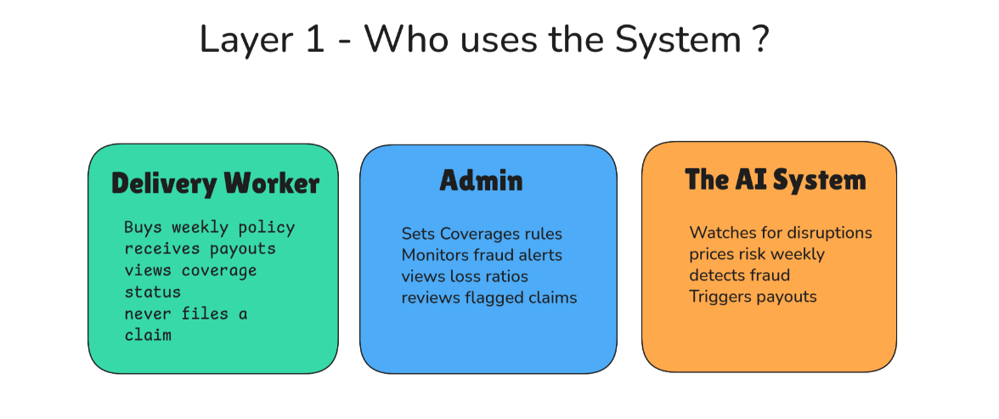
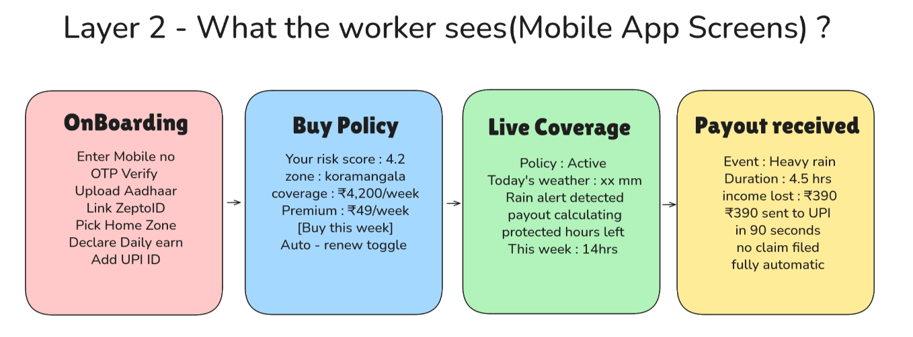
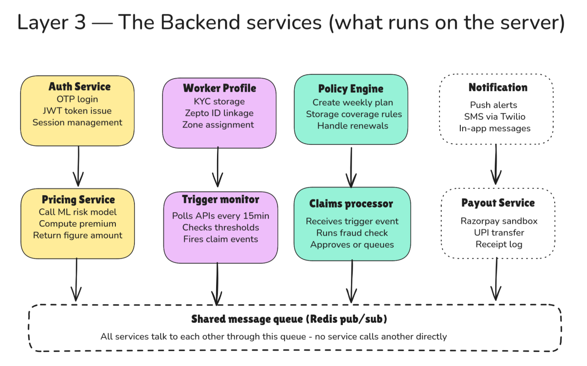
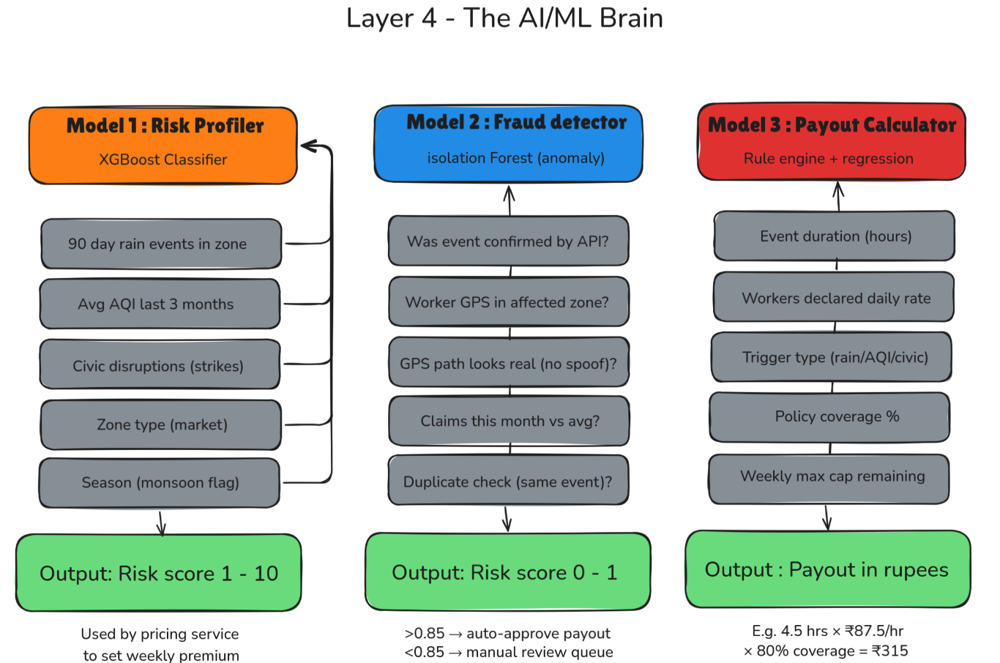
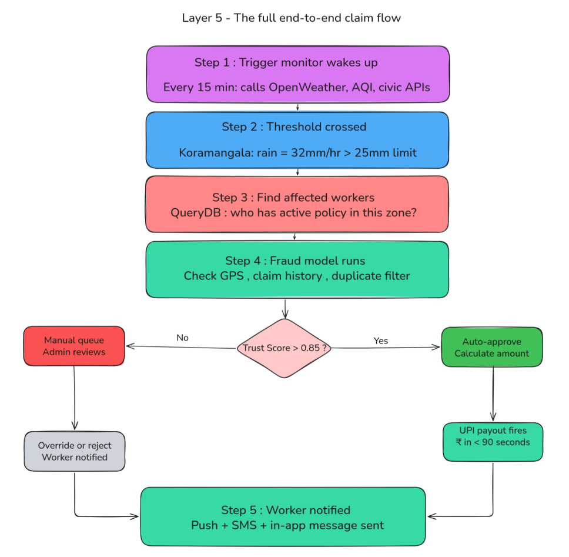
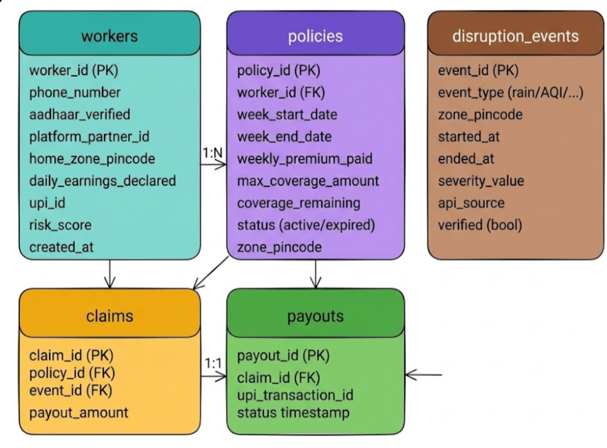

#  AI-Powered Parametric Insurance for Gig Workers

## Team Name - **Build -> Break -> Fix (BBF)**

---

## Overview
GigShield is an insurance platform for Zepto/Blinkit delivery workers. When rain,
pollution, or a curfew stops them from working, the system automatically detects
it and pays them — no forms, no calls, no waiting.

---

## Target Persona

| Field | Detail |
|---|---|
| Delivery partner type | Swiggy Instamart / Zepto / Blinkit (Q-Commerce) |
| Location | Bengaluru, Karnataka |
| Work pattern | 8–10 hours/day, 6 days/week |
| Average daily earnings | ₹600–₹800/day |
| Device | Budget Android smartphone (₹6,000–₹12,000) |
| Payment preference | UPI (GPay, PhonePe, Paytm) |

---

## Platform Choice: Native Mobile App (Android)

GigShield is built as a native Android application, not a web app or PWA.
This decision is driven by industry-scale ambitions and the technical requirements
of our fraud detection architecture.

### Why native Android over PWA or Web

- **Sensor access at industry grade** — our fraud detection relies on accelerometer,
  gyroscope, cell tower ID, and Wi-Fi SSID data. PWAs have severely restricted
  access to these sensors on Android due to browser sandboxing. A native app has
  full, reliable access to all hardware sensors — this is non-negotiable for our
  anti-spoofing layer.

- **Background processing** — the app needs to passively collect GPS and motion
  data during active policy windows to build the behavioral fingerprint used in
  fraud detection. PWAs are killed by Android's battery optimizer within minutes.
  Native apps can run foreground services that survive this.

- **Push notifications that actually work** — native Firebase Cloud Messaging (FCM)
  delivers payout notifications instantly and reliably. PWA push notifications on
  Android have inconsistent delivery, especially on budget devices with aggressive
  battery management (Xiaomi, Realme, Oppo — the exact phones our workers use).

- **Play Store distribution at scale** — industry-scale deployment means onboarding
  thousands of workers across multiple cities. Play Store provides a trusted,
  verifiable installation channel, automatic updates, and crash reporting. A
  WhatsApp link to a PWA does not scale to this.

- **Offline-first architecture** — native apps can use SQLite locally to cache
  the worker's active policy, recent claim status, and payout history. Workers
  can open the app mid-delivery in a tunnel with zero connectivity and still see
  their coverage status.

- **Biometric authentication** — native Android allows fingerprint and face unlock
  for fast, secure login between deliveries. A web app requires a password or OTP
  every time.

### Platform scope

| Surface | Platform |
|---|---|
| Worker app | Native Android (Kotlin + Jetpack Compose) |
| Insurer admin dashboard | Web (React) — desktop only, internal tool |
| Backend API | FastAPI (Python) — consumed by both surfaces |

### Why not iOS

The target persona — Zepto/Blinkit delivery partners in Bengaluru — uses Android
exclusively. iOS market share among gig delivery workers in tier-1 Indian cities
is under 3%. iOS will be considered in Year 2 after Android reaches scale.

---

## Problem Scenario

Ravi is a Zepto delivery partner in Koramangala, Bengaluru. He earns ₹700/day
working 8-hour shifts. When heavy rain hits his zone, he loses 3–4 hours of work
with no safety net. GigShield fixes this.

### Scenario 1: The Monday Routine — Ravi buys his weekly policy
Ravi opens GigShield every Monday morning, sees his AI-computed premium (₹49),
and taps one button to activate coverage. The system creates a policy valid from
Monday 12:00 AM to Sunday 11:59 PM covering up to ₹4,200 of lost income.
He goes to work. The app runs silently in the background.

### Scenario 2: The Tuesday Storm — automatic payout, no action needed
On Tuesday at 2:15 PM, Bengaluru receives 34mm/hr of rainfall. The trigger monitor
detects this via OpenWeatherMap. It confirms Ravi has an active policy in
Koramangala, cross-checks his platform activity (he was online until 2:10 PM),
runs the fraud model (trust score: 0.91), calculates 4 hours of lost income
at ₹87.5/hr = ₹350, and fires a UPI transfer. By 2:17 PM Ravi receives:
*"₹350 has been credited to your UPI account for today's rain disruption."*
He filed nothing. He called no one.

### Scenario 3: The Friday AQI Spike — borderline case handled fairly
Bengaluru's AQI hits 318 in the Silk Board zone. Priya, a Blinkit partner there,
has an active policy. Her fraud score is 0.72 — her cell tower data was weak due
to network congestion. The system does not reject her. Her ₹280 payout is held
for 4 hours while passive signals are rechecked. Her platform history confirms
she was active that morning. At 7:45 PM the payout releases automatically.
Priya received one message: *"Your payout of ₹280 will be credited by 7:45 PM."*
No forms. No anxiety.

### Scenario 4: The Sunday Curfew — civic disruption covered
A sudden Section 144 curfew is imposed in Majestic at 9:00 AM. 430 workers in
that zone have active policies. Ring detection confirms this is genuine — GPS
paths show movement until 8:55 AM and platform activity matches. All 430 claims
are approved in under 3 minutes. Average payout: ₹420 each.

---

## Weekly Premium Model

### How it works
Gig workers get paid per delivery, per day, per week. Annual premiums make no
sense for this persona. GigShield aligns pricing with their earnings cycle —
every Monday a worker buys one week of coverage. If they earn less that week,
next week's premium adjusts downward automatically.

### Premium formula
```
Weekly Premium = Base (₹29)
              + Earnings-linked component (1.4% of declared weekly earnings)
              + Zone risk loading (risk score × ₹1.5)
              + Claims history surcharge (₹4 per prior claim this month)
```

### Example calculation

| Component | Value |
|---|---|
| Base premium | ₹29.00 |
| Earnings-linked (₹700/day × 7 × 1.4%) | ₹68.60 |
| Zone risk loading (score 4.2 × ₹1.5) | ₹6.30 |
| Claims surcharge (0 prior claims) | ₹0.00 |
| **Total weekly premium** | **₹49.00** |
| Maximum weekly coverage | ₹4,200 |

### Pricing boundaries
- **Minimum weekly premium:** ₹35 — accessible even during low-earning weeks
- **Maximum weekly coverage:** 85% of declared 7-day earnings, capped at ₹4,200
- **Premium updates every Monday** — the ML model re-scores the worker's zone
  using the latest 90-day weather and disruption history

---

## Parametric Triggers

These are the five external events that automatically initiate a claim.
No manual reporting required from the worker at any point.

| Trigger | Threshold | Data source | Income payout rate |
|---|---|---|---|
| Heavy rainfall | > 25mm/hr for 2+ hours | OpenWeatherMap API | 80% of hourly rate |
| Severe AQI | AQI > 300 for 3+ hours | AQICN / IQAir API | 60% of hourly rate |
| Extreme heat | Temperature > 42°C for 4+ hours | OpenWeatherMap API | 50% of hourly rate |
| Zone curfew / strike | Section 144 or strike notice | Civic alert API (mocked) | 90% of hourly rate |
| Platform app outage | Zepto/Blinkit app down > 2 hours | Mock platform health API | 70% of hourly rate |

### Payout example
> Rain event: 4.5 hrs × ₹87.5/hr (₹700 ÷ 8hrs) × 80% coverage = **₹315**

---

## Layer 1 — Who Uses the System



- **Delivery worker:** This is Ravi, a Zepto partner in Bengaluru. He earns ₹700/day.
  He opens the GigShield app, buys a ₹49 weekly policy every Monday, and if rain
  shuts his zone down, money lands in his UPI automatically. He never has to file
  a claim.
- **Admin / Insurer:** This is the insurance company's operations team. They log
  into a web dashboard to see how many claims were paid this week, which zones are
  high-risk, and which workers were flagged for fraud.
- **The AI system:** Software running 24/7 in the background — watching weather APIs,
  checking if workers are active, calculating fair premiums, and deciding if a claim
  is genuine.

---

## Layer 2 — What the Worker Sees (Mobile App Screens)



- **Screen 1 — Onboarding:** The worker downloads GigShield from the Play Store and
  signs up in under 3 minutes. They enter their phone number, verify with OTP,
  upload Aadhaar via the camera (native camera access), link their Zepto worker ID,
  pick their home delivery zone, declare daily earnings, add their UPI ID, and grant
  sensor permissions (GPS, accelerometer, cell data) with a plain-language
  explanation of why each permission is needed for fraud protection.

- **Screen 2 — Buy Policy:** After onboarding, the AI has already calculated this
  worker's risk. They see their personal risk score (4.2 out of 10), which zone
  they operate in, what coverage they get (₹4,200/week = about 6 days of earnings),
  and their weekly premium (₹49). They tap one button to activate. They can also
  turn on auto-renew.

- **Screen 3 — Live Coverage:** During an active policy week, this screen shows
  real-time status. If a rain alert is detected in their zone, this screen shows a
  warning, tells them a payout is being calculated, and shows how many protected
  hours they have remaining this week.

- **Screen 4 — Payout Received:** The system detected heavy rain for 4.5 hours,
  calculated ₹390 of lost income, and sent it to the worker's UPI account in 90
  seconds. No forms. No phone calls. Fully automatic.

---

## Layer 3 — The Backend Services



1. **Auth service:** When Ravi opens the app, this service handles his login. It
   sends an OTP to his phone, verifies it, and gives him a JWT token — a digital
   key that proves he's logged in. Every request he makes after that carries this
   token.
2. **Worker profile:** This stores everything about Ravi — his Aadhaar-verified
   name, his Zepto partner ID, his home delivery zone (e.g. Koramangala, pincode
   560034), his declared daily earnings. This is the source of truth for who he is.
3. **Policy engine:** When Ravi buys a policy, this service creates a record: Ravi
   is covered from Monday 12am to Sunday 11:59pm for ₹4,200 in his zone. It stores
   all coverage rules — what disruptions count, for how long, and how much he gets
   per hour lost.
4. **Pricing service:** This service calls the AI risk model, passes it Ravi's zone
   data, earnings, and history, and gets back a ₹ number — his personal weekly
   premium. It's called fresh every Monday so the price adjusts as risk changes
   seasonally.
5. **Trigger monitor:** This runs as a background job every 15 minutes. It calls
   weather APIs, AQI APIs, and civic alert feeds. For each zone where workers have
   active policies, it checks: has any threshold been crossed? If yes, it fires a
   claim event into the queue.
6. **Claims processor:** Receives trigger events from the queue, runs the fraud
   model, calculates payout amount, and either approves the claim automatically or
   sends it to the manual review queue.
7. **Notification service:** Sends push notifications via FCM, SMS via Twilio, and
   in-app messages. Supporting service — communicates decisions, does not make them.
8. **Payout service:** Receives the approved amount and calls Razorpay's API (sandbox
   mode) to transfer it to the worker's UPI. Logs every receipt for audit.
9. **Redis message queue:** Shared communication highway between all services. No
   service calls another directly — everything goes through the queue. This ensures
   no payout is lost even if a service temporarily goes down.

---

## Layer 4 — The AI/ML Brain



### Model 1 — Risk Profiler (XGBoost Classifier)

**Purpose:** Compute a risk score (1–10) per worker per zone, used to set the
weekly premium.

**Input features:**
- Number of rain/flood events in the zone over the last 90 days
- Average AQI reading in the zone over the last 3 months
- Number of civic disruptions (strikes, curfews) in the past year
- Zone type (market area, residential, transit hub)
- Season flag (monsoon = June–September)

**Output:** Risk score 1–10. Score of 2 = calm zone, low premium.
Score of 9 = flood-prone, politically active zone in monsoon, high premium.
Retrained every Monday using the prior week's claims and weather data.

---

### Model 2 — Fraud Detector (Isolation Forest)

**Purpose:** Assign a trust score (0–1) to every claim event. Scores above 0.85
are auto-approved. Below 0.85 go to manual review.

**Input features:**
- Was the disruption event confirmed by the external API?
- Was the worker's GPS coordinates inside the affected zone?
- Does the GPS movement path look like a real delivery route?
- Is the claim frequency normal compared to this worker's own history?
- Has this exact event already been claimed (duplicate check)?

**Output:** Trust score 0–1. Above 0.85 = auto-approve. Below 0.85 = manual queue.

---

### Model 3 — Payout Calculator (Rule Engine + Regression)

**Purpose:** Calculate the exact ₹ amount to transfer.

**Formula:**
```
Payout = Event duration (hrs)
       × Worker's hourly rate (daily earnings ÷ 8)
       × Trigger type coverage rate (80% rain / 60% AQI / 50% heat / 90% curfew)
       × Min(1, coverage remaining ÷ calculated amount)
```

**Output:** Exact rupee amount, capped by remaining weekly coverage balance.

> **Note:** These three models are the foundation. Additional models and features
> will be added in Phases 2 and 3 as the system matures.

---

## Layer 5 — End-to-End Claim Flow



1. **Trigger monitor wakes up** (every 15 min) — proactively calls OpenWeatherMap,
   AQICN, and civic alert APIs for every active zone. Does not wait for anyone to
   complain.
2. **Threshold crossed** — e.g. Koramangala rainfall = 32mm/hr > 25mm/hr limit for
   2+ hours. Event logged with timestamp and event ID.
3. **Affected workers identified** — database queried for all workers with an active
   policy in that zone. One claim event created per worker in the queue.
4. **Fraud model runs** — checks GPS, platform activity, claim history, duplicate
   filter. Outputs a trust score per worker.
   - Trust score > 0.85 → auto-approve, payout in under 90 seconds
   - Trust score < 0.85 → admin review queue, resolved within 4 hours
5. **Worker notified** — push notification sent regardless of outcome:
   - Approved: *"₹390 has been sent to your UPI."*
   - Under review: *"Your claim is being reviewed. We will update you by 6 PM."*

---

## Layer 6 — Database Schema (PostgreSQL)



### Table 1: `workers`
One row per registered worker.

| Column | Type | Description |
|---|---|---|
| worker_id | UUID (PK) | Unique system identifier |
| phone_number | varchar | Login credential |
| aadhaar_verified | bool | KYC completion status |
| platform_partner_id | varchar | Zepto/Blinkit worker badge ID |
| home_zone_pincode | varchar | Primary delivery zone |
| daily_earnings_declared | numeric | Self-declared, used for payout calculation |
| upi_id | varchar | Payout destination |
| risk_score | float | AI-computed, updated every Monday |
| created_at | timestamp | Registration date |

### Table 2: `policies`
One row per week per worker.

| Column | Type | Description |
|---|---|---|
| policy_id | UUID (PK) | Unique policy identifier |
| worker_id | UUID (FK → workers) | Links to the worker |
| week_start_date | date | Monday 12:00 AM |
| week_end_date | date | Sunday 11:59 PM |
| premium_paid | numeric | Amount charged this week |
| max_coverage_amount | numeric | Maximum payout allowed this week |
| coverage_remaining | numeric | Reduces with each payout |
| status | enum | active / expired |
| zone_pincode | varchar | Zone covered by this policy |

### Table 3: `disruption_events`
One row per external disruption detected.

| Column | Type | Description |
|---|---|---|
| event_id | UUID (PK) | Unique event identifier |
| event_type | enum | rain / aqi / heat / curfew / app_outage |
| zone_pincode | varchar | Affected zone |
| started_at | timestamp | When threshold was first crossed |
| ended_at | timestamp | When threshold dropped below limit |
| severity_value | float | Raw API value (e.g. 32.4 mm/hr) |
| api_source | varchar | Which API confirmed the event |
| verified | bool | Cross-checked against second source |

### Table 4: `claims`
One row per claim — bridges a policy to an event.

| Column | Type | Description |
|---|---|---|
| claim_id | UUID (PK) | Unique claim identifier |
| policy_id | UUID (FK → policies) | Which policy week |
| event_id | UUID (FK → disruption_events) | Which disruption |
| payout_amount | numeric | Calculated ₹ amount |
| fraud_score | float | ML model trust score |
| status | enum | approved / under_review / rejected |

### Table 5: `payouts`
One row per completed UPI transfer.

| Column | Type | Description |
|---|---|---|
| payout_id | UUID (PK) | Unique payout identifier |
| claim_id | UUID (FK → claims) | Links to the approved claim |
| amount | numeric | Actual ₹ transferred |
| upi_transaction_id | varchar | Razorpay transaction reference |
| status | enum | success / failed |
| paid_at | timestamp | Transfer completion time |

### Relationships
- `workers` → `policies` : **1:N** — one worker buys many weekly policies over time
- `policies` → `claims` : **1:N** — one policy week can have multiple claims
- `disruption_events` → `claims` : **1:N** — one event triggers claims for all
  workers in that zone simultaneously
- `claims` → `payouts` : **1:1** — one approved claim produces exactly one transfer

---

## Layer 7 — Insurer Admin Dashboard

### Section 1: Top Metric Cards
Four cards displayed at the top of the dashboard:

- **Active policies** — total number of workers who bought a policy this week
  (e.g. 3,847)
- **Premiums collected** — total ₹ amount received from all workers this week
  (e.g. ₹1.88 lakh)
- **Claims paid** — total ₹ paid out this week + loss ratio % below it
  (e.g. ₹94,200 at 50% loss ratio)
- **Fraud alerts** — total ML flags raised + how many pending human review
  (e.g. 14 alerts, 3 pending)

### Section 2: Zone Risk Map Table

| Column | Description |
|---|---|
| Zone name | e.g. Koramangala, Whitefield, Majestic, HSR Layout |
| Active workers | Workers with a live policy in that zone this week |
| Risk score | AI score — green (1–4), orange (5–7), red (8–10) |
| Claims this week | Payouts processed in that zone this week |

### Section 3: Fraud Review Queue
Each flagged entry shows:

- **Worker ID** — anonymous identifier (e.g. #RV-4421)
- **Trust score** — e.g. 0.41 = very suspicious, 0.71 = borderline
- **Flag reason:**
  - GPS coordinates do not match registered zone
  - GPS path looks like spoofing (static location, not a moving bike)
  - Claimed for a disruption event outside policy zone
  - Claim frequency unusually high vs personal history
  - Duplicate claim — same event already paid
- **Action buttons:** `Approve payout` or `Reject claim`

### Section 4: AI Forecast Panel
Three forward-looking predictions for the coming week:

- **Predicted claims volume** — ₹ range based on IMD weather forecast
  (e.g. ₹1.2L–₹1.6L if heavy rain forecast Mon–Wed)
- **High-risk zones next week** — zones likely to generate heavy claims, with a
  recommendation to raise their premiums
- **Reserve recommendation** — exact ₹ amount to hold in liquid float
  (e.g. Hold ₹1.8L to cover expected payouts without a shortfall)

---

## Tech Stack

### Frontend
| Tool | Purpose |
|---|---|
| Android (Kotlin + Jetpack Compose) | Worker mobile app — native, Play Store distributed, full sensor access |
| React (Web) | Insurer admin dashboard — desktop only, internal tool |
| Firebase Cloud Messaging (FCM) | Push notifications — payout alerts, claim status updates |
| SQLite (Room) | Local offline cache — policy status, claim history, payout records |

### Backend
| Tool | Purpose |
|---|---|
| FastAPI (Python) | Main API server — auth, policies, claims, async processing |
| Celery | Background job runner — trigger monitor every 15 minutes |
| Redis | Message queue + Celery broker — inter-service communication |
| PostgreSQL | Primary database — all 5 tables |

### AI / ML
| Tool | Purpose |
|---|---|
| XGBoost | Risk profiling model — zone risk score 1–10 |
| Isolation Forest (scikit-learn) | Fraud detection — claim trust score 0–1 |
| Pandas + NumPy | Feature engineering and data preprocessing |
| NetworkX | Graph analysis for syndicate/ring detection |

### External Integrations
| Service | Purpose | Mode |
|---|---|---|
| OpenWeatherMap API | Rain + heat data per pincode | Free tier |
| AQICN API | Real-time AQI per zone | Free token |
| Razorpay | UPI payout transfers | Sandbox mode |
| Twilio | SMS notifications | Trial mode |
| Zepto/Blinkit partner API | Worker activity heartbeat | Mocked (JSON fixtures) |
| Civic alert feed | Curfew and strike notifications | Mocked (JSON fixtures) |

### DevOps
| Tool | Purpose |
|---|---|
| Docker Compose | One command spins up all services locally |
| GitHub | Version control — single repo across all 3 phases |
| Railway / Render | Free-tier cloud deployment for live judge demo |

---

## Development Plan

### Phase 1 — Weeks 1–2: Ideate & Know Your Worker (Mar 4–20)

**Week 1**
- [ ] Finalize persona research — Zepto/Blinkit zone data, earnings benchmarks
- [ ] Define all 5 parametric triggers with exact thresholds
- [ ] Design weekly premium formula and test with sample worker profiles
- [ ] Draft full database schema (all 5 tables)
- [ ] Set up GitHub repository and project folder structure

**Week 2**
- [ ] Write complete README (this document)
- [ ] Create system architecture diagrams (Layers 1–7)
- [ ] Record 2-minute strategy video
- [ ] Set up Docker Compose skeleton — FastAPI + PostgreSQL + Redis
- [ ] Deliverable: README.md submitted by March 20 EOD

---

### Phase 2 — Weeks 3–4: Automate & Protect (Mar 21–Apr 4)

**Week 3**
- [ ] Build worker registration and OTP login flow
- [ ] Build policy creation API with weekly pricing logic
- [ ] Connect OpenWeatherMap and AQICN APIs to trigger monitor
- [ ] Implement 3 of 5 parametric triggers — rain, AQI, heat

**Week 4**
- [ ] Implement remaining 2 triggers — curfew mock, app outage mock
- [ ] Build basic Isolation Forest fraud model
- [ ] Build claims processor with auto-approve / manual queue routing
- [ ] Build Android worker app (Kotlin + Jetpack Compose) — all 4 screens
- [ ] Record 2-minute demo video
- [ ] Deliverable: Working registration → policy → claim flow

---

### Phase 3 — Weeks 5–6: Scale & Perfect (Apr 5–17)

**Week 5**
- [ ] Upgrade fraud model with accelerometer, cell tower, ring detection
- [ ] Integrate Razorpay sandbox for live UPI payout simulation
- [ ] Build insurer admin dashboard — all 4 sections
- [ ] Add SMS notifications via Twilio trial

**Week 6**
- [ ] End-to-end demo simulation — trigger fake rainstorm → auto claim → payout
- [ ] Performance test trigger monitor under 500 simultaneous claims
- [ ] Record 5-minute walkthrough demo video
- [ ] Prepare final pitch deck PDF
- [ ] Deliverable: Full platform live on Railway/Render with public URL

---

# Adversarial Defense & Anti-Spoofing Strategy

> **Threat context:** A coordinated syndicate of 500+ workers used GPS-spoofing apps
> to fake presence in red-alert weather zones while safely at home, draining the
> liquidity pool via mass false parametric payouts.

---

## 1. Differentiation — Genuine Worker vs Bad Actor

The core insight: **a real delivery worker caught in a storm behaves very
differently from someone spoofing at home.** We do not rely on GPS alone. We build
a behavioral fingerprint from multiple independent signal layers that are extremely
difficult to fake simultaneously.

### Layer 1: Device sensor cross-validation
- A real worker on a bike in heavy rain produces accelerometer and gyroscope motion
  data consistent with riding, stopping, and navigating
- A spoofed device on a desk produces flat, near-zero motion readings
- Mismatch between "GPS says moving" and "sensors say stationary" = immediate flag

### Layer 2: Network triangulation vs GPS
- GPS can be spoofed by an app, but cell tower triangulation and Wi-Fi network IDs
  cannot be spoofed by the same app at the same time
- We cross-check GPS coordinates against:
  - Cell towers the phone is connected to (independent of GPS)
  - Wi-Fi SSIDs visible to the device (home Wi-Fi appearing = worker is indoors)
- GPS says "Koramangala flood zone" but cell tower says "HSR Layout residential"
  and home Wi-Fi is visible = hard fraud signal

### Layer 3: Platform activity heartbeat
- A real worker caught in a disruption shows recent order activity in the 60
  minutes before the event
- A fraudster at home shows zero platform activity for hours before claiming
- No order pings + no motion + GPS in flood zone = coordinated fraud pattern

### Layer 4: Temporal behavior consistency
- We compare the GPS path during the claim window against 30+ days of historical
  movement patterns
- A genuine worker's storm path looks like their normal routes, just slower
- A spoofed path shows a static pin, a perfect straight line, or a location the
  worker has never visited in their history

---

## 2. Data Points for Detecting a Coordinated Fraud Ring

### Individual-level signals

| Data point | What it reveals |
|---|---|
| Accelerometer / gyroscope readings | Physical motion vs stationary device |
| Cell tower ID at time of claim | True coarse location, independent of GPS |
| Wi-Fi SSIDs visible to device | Home network presence = worker is indoors |
| Platform order activity (last 2 hrs) | Was the worker actually working? |
| Battery drain rate during event | GPS spoofing apps consume abnormally high battery |
| App foreground/background state | Spoofing apps require a specific phone state |
| Historical zone visit frequency | Has this worker ever been to this zone before? |
| Claim-to-active-hours ratio | Claims vs hours actually logged on platform |

### Ring-level signals (cross-worker analysis)

| Data point | What it reveals |
|---|---|
| Claim submission timestamp clustering | 500 claims in 90 seconds = coordinated |
| Identical GPS coordinates across workers | Multiple workers on the exact same pin |
| Device ID overlap | Same device filing claims under different worker IDs |
| New account surge | Spike in registrations in one pincode before a weather event |
| Shared IP address at claim time | Multiple claims from the same home network |
| Claim zone vs registered zone mismatch rate | 400 workers suddenly in Majestic = not coincidence |

### Syndicate detection algorithm
- Graph network analysis runs on every batch of claims in the same 15-minute window
- Workers are nodes; shared signals (IP, GPS pin, device, timing) are edges
- A densely connected subgraph of 10+ workers with 3+ shared signals = syndicate flag
- The entire subgraph is frozen simultaneously for admin review

---

## 3. UX Balance — Protecting Honest Workers

A genuine worker in a flood zone may have poor GPS signal, dropped cell data,
low battery, or be delivering in a new zone for the first time. We must not
penalize them for technical failures caused by the very disruption we are insuring.

### Tier 1: Auto-approved (trust score > 0.85)
- All signals consistent, platform activity confirmed, no ring flags
- **Action:** Payout fires in under 90 seconds
- **Worker experience:** Completely seamless, invisible

### Tier 2: Soft flag — grace period payout (trust score 0.65–0.85)
- One or two weak signals but no hard contradictions, not in a ring
- **Action:** Payout approved, held 4 hours, releases automatically if no new
  contradictions emerge
- **Worker experience:** *"Your payout of ₹390 will be credited by 6:00 PM today."*

### Tier 3: Assisted verification (trust score 0.40–0.65)
- Multiple weak signals or one contradiction, not in a ring
- **Action:** Single one-tap prompt — *"Please confirm you were delivering in
  Koramangala today."* One button. No documents. No calls.
- Payout releases within 30 minutes if re-check passes
- **Worker experience:** One notification, one tap, done

### Tier 4: Hard freeze — ring detection triggered
- Worker is part of a detected coordinated subgraph
- **Action:** Claim frozen, worker notified —
  *"Your claim is under a brief security review due to unusual activity in your
  area. This is not a rejection. We will update you within 24 hours."*
- Innocent workers with verifiable platform history are cleared and paid first
- **Worker experience:** Honest workers resolved within 24 hours with full payout

---

## 4. Architectural Summary
```
Claim event received
        │
        ▼
┌─────────────────────────────┐
│  Individual fraud model     │  ← accelerometer, cell tower, Wi-Fi,
│  (Isolation Forest)         │    platform activity, historical zones
└────────────┬────────────────┘
             │
             ▼
┌─────────────────────────────┐
│  Ring detection layer       │  ← timestamp clustering, shared GPS pins,
│  (Graph network analysis)   │    shared IPs, device ID overlap
└────────────┬────────────────┘
             │
      ┌──────┴────────────────────────────────┐
      ▼             ▼                ▼                  ▼
Score > 0.85   Score 0.65–0.85  Score 0.40–0.65   Ring detected
Auto-approve   4-hr grace hold  One-tap verify    Full freeze +
< 90 seconds   auto-releases    30-min resolve    admin review
```

---

## 5. What This Costs Us (Honest Trade-offs)

- **Sensor data collection** requires explicit user consent at onboarding —
  clearly communicated as fraud prevention, not surveillance
- **The 4-hour grace hold** means some honest workers wait longer than 90 seconds —
  accepted cost of protecting the liquidity pool
- **Graph analysis adds 8–12 seconds** to the pipeline during large weather events —
  acceptable latency
- **False positives will happen.** Our 24-hour review SLA for ring-flagged workers
  is our commitment that no honest worker is permanently denied without a human
  decision

---

## Business Viability

| Metric | Value |
|---|---|
| Weekly premium per worker | ₹49 |
| Target active workers Year 1 (Bengaluru) | 10,000 |
| Gross weekly premium revenue | ₹4.9 lakh |
| Expected loss ratio | 45–55% |
| Weekly operating margin | ₹2.2–₹2.7 lakh |
| Annual revenue run rate | ~₹2.5 crore |

- At 50% loss ratio the insurer retains ₹24.50 per worker per week
- Monsoon months push loss ratio to 65–70%, offset by dry months at 20–30%
- The AI forecast panel gives advance warning to adjust premiums before high-risk weeks
- ₹49 is less than the value of one lost delivery order — the product sells itself

---

## Constraints Compliance

| Rule | Status |
|---|---|
| Coverage limited to income loss only | ✅ No health, life, accident, or vehicle repair coverage |
| Weekly pricing model | ✅ Premium charged every Monday, policy valid Mon–Sun |
| Delivery partner persona only | ✅ Zepto/Blinkit/Instamart Q-Commerce workers only |
| Parametric triggers only | ✅ All triggers are data-driven thresholds, no subjective claims |
| No manual claim filing by worker | ✅ All claims initiated automatically by the trigger monitor |

---

## Data Privacy & Consent

GigShield collects device sensor data (accelerometer, cell tower, Wi-Fi SSIDs)
via native Android APIs for fraud prevention purposes. All permission requests
follow Android 13+ granular permission standards — workers explicitly grant each
permission individually at onboarding with a plain-language explanation shown
before each system prompt.

- **Explicit consent collected at onboarding** — workers see a plain-language
  explanation of what data is collected and why before agreeing
- **Sensor data is never sold or shared** with third parties including Zepto/Blinkit
- **Data is used exclusively** for fraud detection during active claim windows —
  not for continuous background surveillance
- **Workers can request deletion** of their sensor history at any time via the app
- **All data stored encrypted** at rest in PostgreSQL with AES-256
- Compliant with **India's Digital Personal Data Protection Act 2023 (DPDPA)**